# Longan Apex 系统架构文档

## 1. 系统架构图 (System Architecture Diagram)

```mermaid
graph TB
    subgraph "客户端层 (Client Layer)"
        CLI["Web浏览器<br/>Swagger UI"]
        MOB["移动端<br/>H5/App"]
    end

    subgraph "网关层 (Gateway Layer)"
        MVC["Spring Web MVC<br/>DispatcherServlet"]
        JWT["JWT 认证拦截器<br/>JwtTokenInterceptor"]
    end

    subgraph "控制层 (Controller Layer)"
        UC["UserController<br/>/api/user/**"]
        GC["GoodsController<br/>/api/goods/**"]
        OC["OrderController<br/>/api/order/**"]
        CC["CommonController<br/>/api/common/**"]
        CaC["CategoryController<br/>/api/category/**"]
    end

    subgraph "业务层 (Service Layer)"
        US["UserService"]
        UPS["UserProfileService"]
        UWS["UserWalletService"]
        UCS["UserCreditService"]
        UBS["UserBehaviorService"]
        GS["GoodsService"]
        GIS["GoodsImageService"]
        GCS["GoodsCollectService"]
        CaS["CategoryService"]
        OS["OrderService"]
        PS["PaymentService"]
        RS["RefundService"]
        RVS["ReviewService"]
        ChS["ChatService"]
        SMS["SysMessageService"]
        PCS["PlatformConfigService"]
    end

    subgraph "数据访问层 (DAO/Mapper Layer)"
        UM["UserMapper"]
        UPM["UserProfileMapper"]
        UWM["UserWalletMapper"]
        WLM["WalletLogMapper"]
        UCM["UserCreditMapper"]
        UBM["UserBehaviorMapper"]
        GM["GoodsMapper"]
        GIM["GoodsImageMapper"]
        GCM["GoodsCollectMapper"]
        GTM["GoodsTagMapper"]
        CaM["CategoryMapper"]
        OM["OrderMapper"]
        OAM["OrderAddressMapper"]
        PM["PaymentMapper"]
        RFM["RefundMapper"]
        RVM["ReviewMapper"]
        RIM["ReviewImageMapper"]
        CCM["ChatConversationMapper"]
        CMM["ChatMessageMapper"]
        SMM["SysMessageMapper"]
        PCM["PlatformConfigMapper"]
    end

    subgraph "基础设施层 (Infrastructure)"
        DB[("MySQL<br/>longan_apex")]
        FS[("文件存储<br/>/opt/longan/images/")]
        LOG["日志<br/>Logback"]
    end

    subgraph "公共组件 (Common Components)"
        R["统一响应<br/>Result / PageResult"]
        EX["全局异常处理<br/>GlobalExceptionHandler"]
        C["配置类<br/>OpenApi/MyBatis-Plus/WebMvc"]
        U["工具类<br/>UserContext / MyMetaObjectHandler"]
    end

    CLI --> MVC
    MOB --> MVC
    MVC --> JWT

    JWT --> UC
    JWT --> GC
    JWT --> OC
    JWT --> CC
    JWT --> CaC

    UC --> US
    UC --> UPS
    UC --> UWS
    GC --> GS
    GC --> GIS
    GC --> GCS
    GC --> CaS
    OC --> OS
    OC --> PS
    OC --> RS
    OC --> RVS
    CC --> PCS

    US --> UM
    UPS --> UPM
    UWS --> UWM
    UWS --> WLM
    UCS --> UCM
    UBS --> UBM
    GS --> GM
    GIS --> GIM
    GCS --> GCM
    GCS --> GTM
    CaS --> CaM
    OS --> OM
    PS --> PM
    RS --> RFM
    RVS --> RVM
    RVS --> RIM
    ChS --> CCM
    ChS --> CMM
    SMS --> SMM
    PCS --> PCM

    UM --> DB
    UPM --> DB
    UWM --> DB
    WLM --> DB
    UCM --> DB
    UBM --> DB
    GM --> DB
    GIM --> DB
    GCM --> DB
    GTM --> DB
    CaM --> DB
    OM --> DB
    OAM --> DB
    PM --> DB
    RFM --> DB
    RVM --> DB
    RIM --> DB
    CCM --> DB
    CMM --> DB
    SMM --> DB
    PCM --> DB

    CC --> FS

    JWT -.-> C
    UC -.-> R
    GC -.-> R
    OC -.-> R
    CC -.-> R
    US -.-> EX
    GS -.-> EX
    OS -.-> EX

    classDef client fill:#e1f5fe,stroke:#0288d1
    classDef gateway fill:#fff3e0,stroke:#f57c00
    classDef controller fill:#e8f5e9,stroke:#388e3c
    classDef service fill:#fce4ec,stroke:#d81b60
    classDef mapper fill:#f3e5f5,stroke:#7b1fa2
    classDef infra fill:#efebe9,stroke:#5d4037
    classDef common fill:#fff8e1,stroke:#fbc02d

    class CLI,MOB client
    class MVC,JWT gateway
    class UC,GC,OC,CC,CaC controller
    class US,UPS,UWS,UCS,UBS,GS,GIS,GCS,CaS,OS,PS,RS,RVS,ChS,SMS,PCS service
    class UM,UPM,UWM,WLM,UCM,UBM,GM,GIM,GCM,GTM,CaM,OM,OAM,PM,RFM,RVM,RIM,CCM,CMM,SMM,PCM mapper
    class DB,FS,LOG infra
    class R,EX,C,U common
```

---

## 2. 系统流程图 (System Flowchart)

### 2.1 用户注册流程

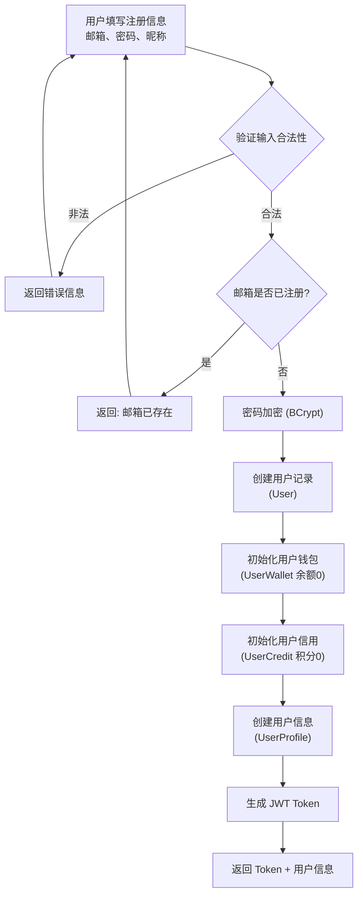

### 2.2 用户登录流程

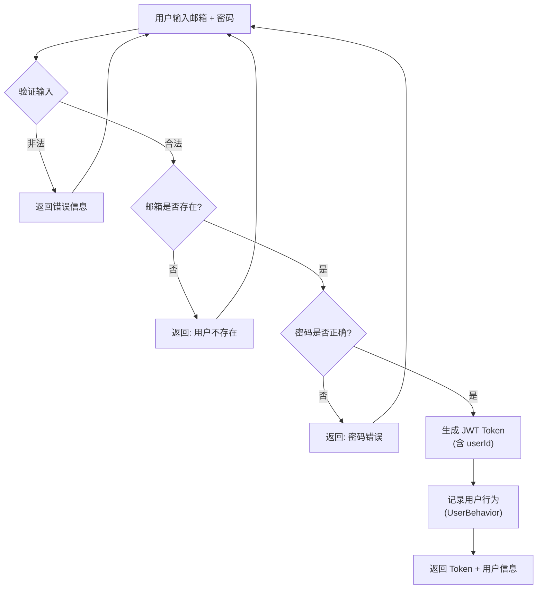

### 2.3 商品发布流程

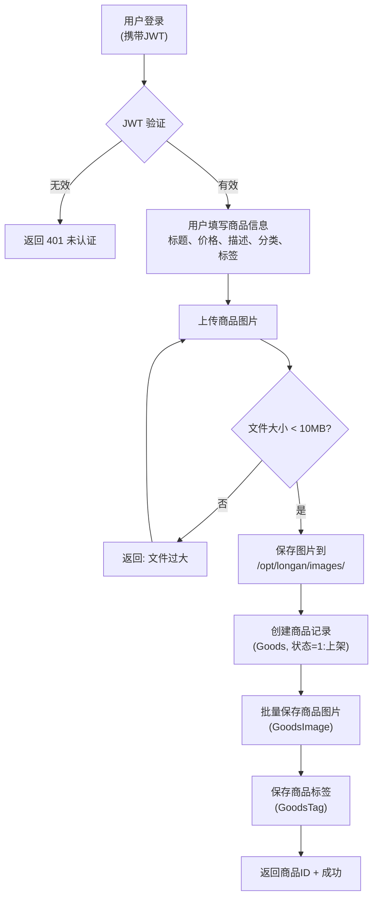

### 2.4 订单创建与交易流程

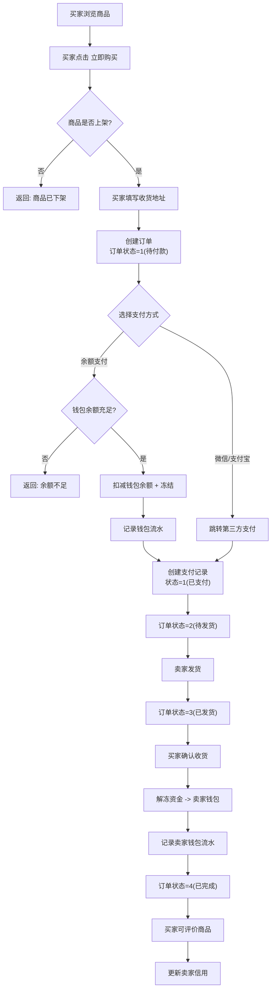

### 2.5 退款流程

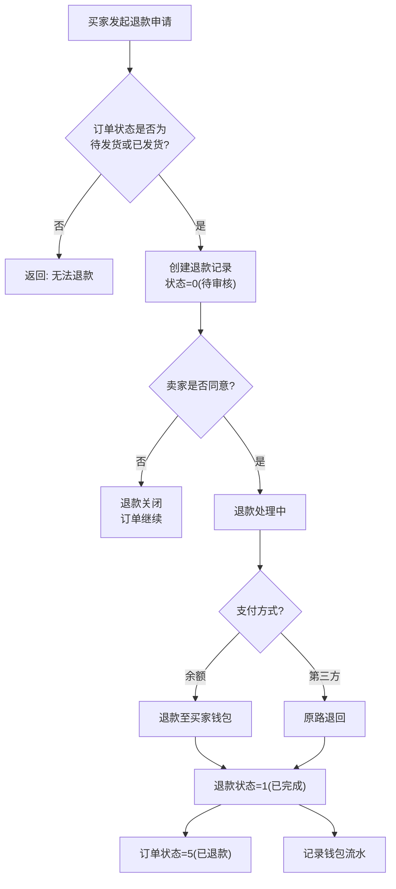

---

## 3. 数据流图 (Data Flow Diagram)

### 3.0 图例

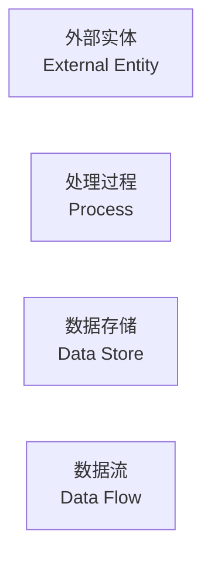

### 3.1 第0层数据流图（上下文图）

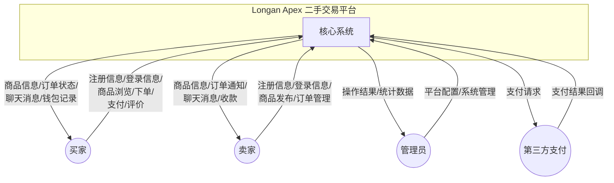

### 3.2 第1层数据流图

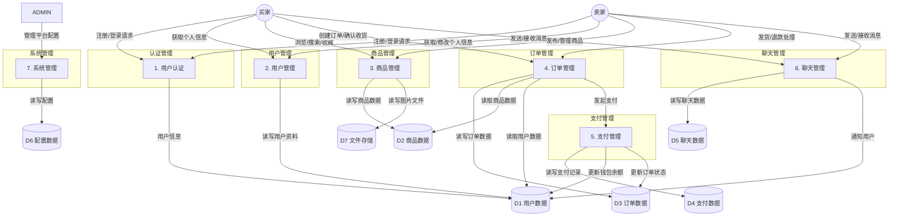

### 3.3 第2层数据流图 - 订单处理

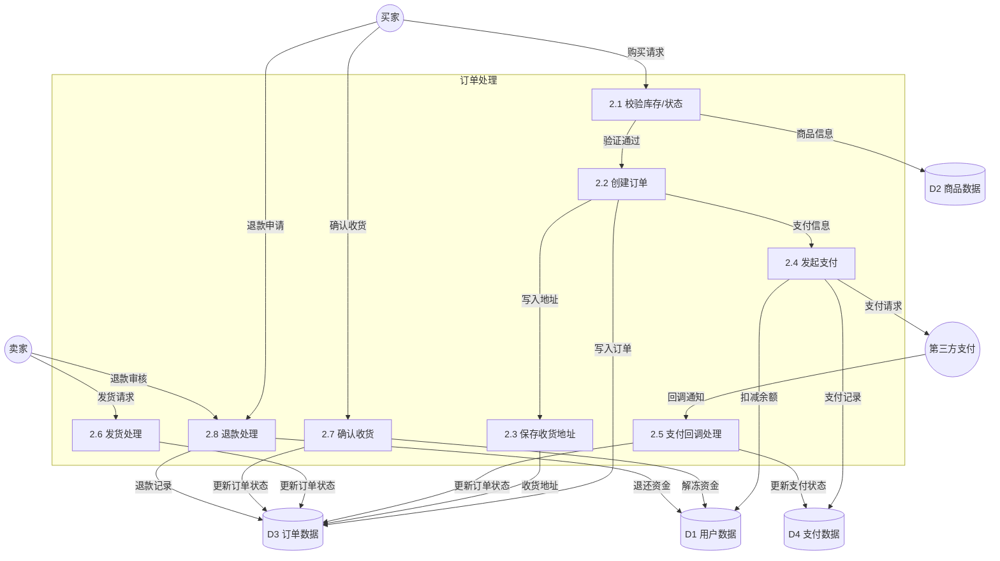

---

## 4. E-R 图 (Entity-Relationship Diagram)

```mermaid
erDiagram
    %% ==================== 用户模块 ====================
    user {
        bigint id PK "主键ID"
        varchar email "邮箱(登录账号)"
        varchar password "密码(BCrypt加密)"
        varchar nickname "昵称"
        varchar avatar "头像URL"
        tinyint role "角色:1买家2卖家"
        tinyint status "状态:1正常2禁用"
        datetime create_time "创建时间"
        datetime update_time "更新时间"
    }

    user_profile {
        bigint id PK
        bigint user_id FK "用户ID"
        tinyint gender "性别:0未知1男2女"
        date birthday "生日"
        varchar phone "手机号"
        varchar address "地址"
        varchar signature "个性签名"
        datetime create_time
        datetime update_time
    }

    user_wallet {
        bigint id PK
        bigint user_id FK "用户ID"
        decimal balance "余额"
        decimal freeze "冻结金额"
        decimal total_income "累计收入"
        decimal total_outcome "累计支出"
        datetime create_time
        datetime update_time
    }

    user_wallet_log {
        bigint id PK
        bigint user_id FK "用户ID"
        bigint wallet_id FK "钱包ID"
        decimal amount "变动金额(±)"
        varchar type "类型:收入/支出/退款/冻结"
        varchar biz_type "业务类型"
        varchar remark "备注"
        datetime create_time
    }

    user_credit {
        bigint id PK
        bigint user_id FK "用户ID"
        int score "信用积分"
        int level "信用等级"
        int good_reviews "好评数"
        int bad_reviews "差评数"
        datetime create_time
        datetime update_time
    }

    user_behavior {
        bigint id PK
        bigint user_id FK "用户ID"
        varchar behavior_type "行为类型"
        bigint target_id "目标ID"
        varchar remark "备注"
        datetime create_time
    }

    %% ==================== 商品模块 ====================
    goods {
        bigint id PK
        bigint seller_id FK "卖家ID"
        bigint category_id FK "分类ID"
        varchar title "商品标题"
        text description "商品描述"
        decimal price "价格"
        varchar quality "成色"
        tinyint status "状态:1上架2下架3售出"
        int view_count "浏览量"
        int collect_count "收藏量"
        datetime create_time
        datetime update_time
    }

    goods_category {
        bigint id PK
        varchar name "分类名称"
        bigint parent_id "父分类ID(0=顶级)"
        int sort "排序"
        tinyint status "状态"
        datetime create_time
    }

    goods_image {
        bigint id PK
        bigint goods_id FK "商品ID"
        varchar image_url "图片URL"
        int sort "排序"
        datetime create_time
    }

    goods_collect {
        bigint id PK
        bigint user_id FK "用户ID"
        bigint goods_id FK "商品ID"
        datetime create_time
    }

    goods_tag {
        bigint id PK
        bigint goods_id FK "商品ID"
        varchar tag_name "标签名"
        datetime create_time
    }

    %% ==================== 订单模块 ====================
    order {
        bigint id PK
        varchar order_no "订单号"
        bigint buyer_id FK "买家ID"
        bigint seller_id FK "卖家ID"
        bigint goods_id FK "商品ID"
        decimal goods_price "商品价格"
        decimal total_price "总价"
        decimal freight "运费"
        tinyint status "状态:1待付款2待发货3已发货4已完成5已退款6已关闭"
        varchar buyer_remark "买家备注"
        datetime create_time
        datetime update_time
    }

    order_address {
        bigint id PK
        bigint order_id FK "订单ID"
        varchar consignee "收货人"
        varchar phone "电话"
        varchar province "省"
        varchar city "市"
        varchar district "区"
        varchar detail_address "详细地址"
        datetime create_time
    }

    order_payment {
        bigint id PK
        bigint order_id FK "订单ID"
        bigint user_id FK "用户ID"
        decimal amount "支付金额"
        varchar pay_type "支付方式:coin/wechat/alipay"
        tinyint status "状态:0未支付1已支付2已退款"
        varchar trade_no "第三方支付流水号"
        datetime create_time
        datetime update_time
    }

    order_refund {
        bigint id PK
        bigint order_id FK "订单ID"
        bigint user_id FK "用户ID"
        decimal amount "退款金额"
        varchar reason "退款原因"
        tinyint status "状态:0待审核1已完成2已拒绝"
        datetime create_time
        datetime update_time
    }

    order_review {
        bigint id PK
        bigint order_id FK "订单ID"
        bigint user_id FK "用户ID"
        bigint goods_id FK "商品ID"
        tinyint score "评分(1-5)"
        text content "评价内容"
        datetime create_time
        datetime update_time
    }

    order_review_image {
        bigint id PK
        bigint review_id FK "评价ID"
        varchar image_url "图片URL"
        datetime create_time
    }

    %% ==================== 聊天模块 ====================
    chat_conversation {
        bigint id PK
        bigint user1_id FK "用户1"
        bigint user2_id FK "用户2"
        varchar last_message "最后一条消息"
        datetime last_time "最后消息时间"
        datetime create_time
        datetime update_time
    }

    chat_message {
        bigint id PK
        bigint conversation_id FK "会话ID"
        bigint sender_id FK "发送方"
        bigint receiver_id FK "接收方"
        text content "消息内容"
        tinyint msg_type "消息类型:1文本2图片3系统"
        tinyint is_read "是否已读"
        datetime create_time
    }

    chat_sys_message {
        bigint id PK
        bigint user_id FK "用户ID"
        varchar title "标题"
        text content "内容"
        tinyint msg_type "消息类型"
        tinyint is_read "是否已读"
        datetime create_time
    }

    %% ==================== 公共模块 ====================
    platform_config {
        bigint id PK
        varchar config_key "配置键"
        text config_value "配置值"
        varchar remark "备注"
        datetime create_time
        datetime update_time
    }

    %% ==================== 关系定义 ====================
    %% 用户模块关系
    user ||--o| user_profile : "has"
    user ||--o| user_wallet : "has"
    user ||--o| user_credit : "has"
    user ||--o{ user_behavior : "has"
    user_wallet ||--o{ user_wallet_log : "has"

    %% 商品模块关系
    user ||--o{ goods : "发布"
    goods_category ||--o{ goods : "属于"
    goods ||--o{ goods_image : "拥有"
    goods ||--o{ goods_tag : "拥有"
    user ||--o{ goods_collect : "收藏"
    goods ||--o{ goods_collect : "被收藏"

    %% 订单模块关系
    user ||--o{ order : "买家(下单)"
    user ||--o{ order : "卖家(接单)"
    goods ||--o{ order : "关联"
    order ||--o| order_address : "配送至"
    order ||--o{ order_payment : "支付记录"
    order ||--o{ order_refund : "退款记录"
    order ||--o{ order_review : "评价"
    order_review ||--o{ order_review_image : "评价图片"

    %% 聊天模块关系
    user ||--o{ chat_conversation : "参与"
    chat_conversation ||--o{ chat_message : "包含"
    user ||--o{ chat_message : "发送"
    user ||--o{ chat_sys_message : "接收"
```

---

## 5. 模块依赖关系图

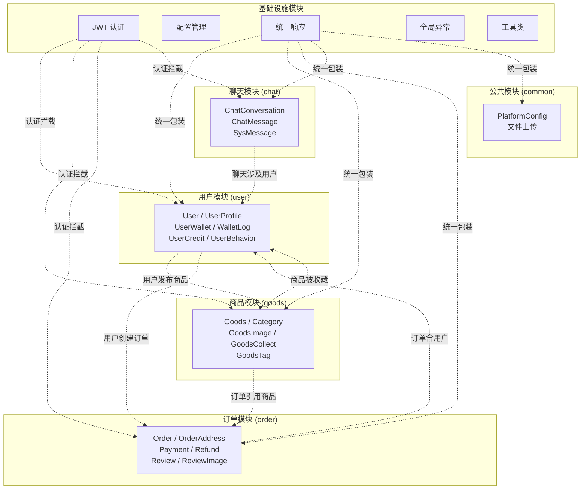

---

## 6. 数据库表关系总览

```mermaid
flowchart LR
    USER["user<br/>用户表"]
    PROFILE["user_profile<br/>用户详情表"]
    WALLET["user_wallet<br/>钱包表"]
    WALLET_LOG["user_wallet_log<br/>钱包流水表"]
    CREDIT["user_credit<br/>信用表"]
    BEHAVIOR["user_behavior<br/>行为表"]

    USER --- PROFILE
    USER --- WALLET
    USER --- CREDIT
    USER --- BEHAVIOR
    WALLET --- WALLET_LOG

    CATEGORY["goods_category<br/>分类表"]
    GOODS["goods<br/>商品表"]
    IMAGE["goods_image<br/>商品图片表"]
    COLLECT["goods_collect<br/>收藏表"]
    TAG["goods_tag<br/>标签表"]

    CATEGORY --- GOODS
    GOODS --- IMAGE
    GOODS --- COLLECT
    GOODS --- TAG
    USER --- COLLECT
    USER --- GOODS

    ORDER["order<br/>订单表"]
    ADDRESS["order_address<br/>地址表"]
    PAYMENT["order_payment<br/>支付表"]
    REFUND["order_refund<br/>退款表"]
    REVIEW["order_review<br/>评价表"]
    REVIEW_IMG["order_review_image<br/>评价图片表"]

    USER --- ORDER
    GOODS --- ORDER
    ORDER --- ADDRESS
    ORDER --- PAYMENT
    ORDER --- REFUND
    ORDER --- REVIEW
    REVIEW --- REVIEW_IMG

    CONVERSATION["chat_conversation<br/>会话表"]
    MESSAGE["chat_message<br/>消息表"]
    SYS_MSG["chat_sys_message<br/>系统消息表"]

    USER --- CONVERSATION
    CONVERSATION --- MESSAGE
    USER --- SYS_MSG

    CONFIG["platform_config<br/>配置表"]
